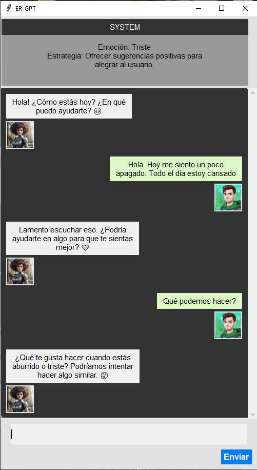

# ER-GPT

Chatbot powered by GPT-3.5 that recognizes the user's emotion (and displays it), decides what strategy to implement to make the user feel good (and displays it) and puts it into action in its conversation with the user.

This application uses the OpenAI API and a simple interface with Tkinter that simulates a chat. It is mainly a proof-of-concept application.

An example of a chatbot conversation. On the right the user's messages, on the left the chatbot's messages. At the top you can see the emotion recognized by the chatbot and the strategy it proposes to perform (it is updated after each message from the user):

